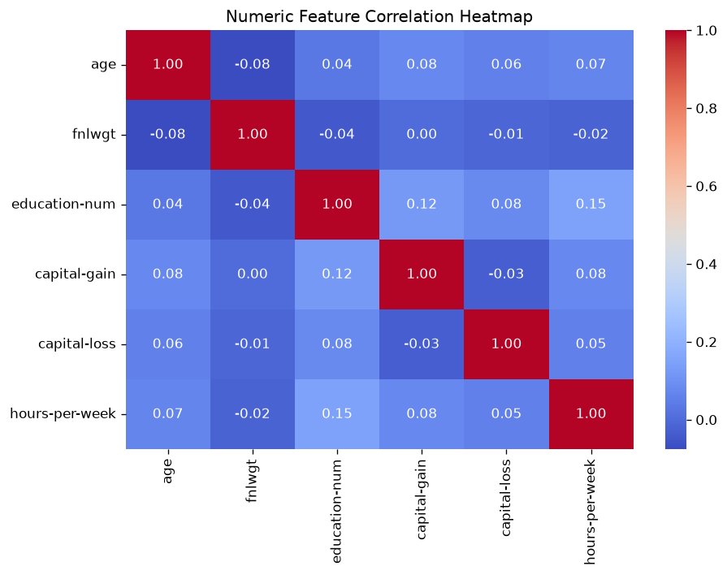
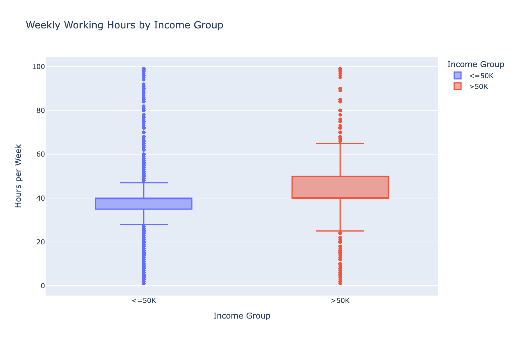

# Adult Census Income 분석 리포트

생성 시각: 2026-07-21 16:26:14

## 1. 데이터 개요

- 원본 데이터: 32561행 x 15열
- 정제 후 데이터: 32537행 x 15열 (결측치 처리 + 중복 제거 완료)
- 제거된 행 수: 24행

## 2. 기술통계 (수치형 변수)

| 컬럼 | count | mean | std | min | 25% | 50% | 75% | max |
|---|---|---|---|---|---|---|---|---|
| age | 32537 | 38.59 | 13.64 | 17.00 | 28.00 | 37.00 | 48.00 | 90.00 |
| fnlwgt | 32537 | 189780.85 | 105556.47 | 12285.00 | 117827.00 | 178356.00 | 236993.00 | 1484705.00 |
| education-num | 32537 | 10.08 | 2.57 | 1.00 | 9.00 | 10.00 | 12.00 | 16.00 |
| capital-gain | 32537 | 1078.44 | 7387.96 | 0.00 | 0.00 | 0.00 | 0.00 | 99999.00 |
| capital-loss | 32537 | 87.37 | 403.10 | 0.00 | 0.00 | 0.00 | 0.00 | 4356.00 |
| hours-per-week | 32537 | 40.44 | 12.35 | 1.00 | 40.00 | 40.00 | 45.00 | 99.00 |


## 3. 상관관계

수치형 변수 간 상관관계 히트맵:



가장 상관관계가 높은 두 변수: **education-num** ↔ **hours-per-week** (r = 0.15)

## 4. 통계 검정: t-test ('>50K' vs '<=50K' on 'hours-per-week')

- '>50K' 그룹 평균: 45.47 (n=7839)
- '<=50K' 그룹 평균: 38.84 (n=24698)
- t-statistic: 45.0950
- p-value: 0.0000

**결론**: 유의수준 0.05에서 '>50K' 그룹과 '<=50K' 그룹의 'hours-per-week' 평균 차이는 통계적으로 유의하다. (p < 0.05)


## 5. ML Pipeline 평가 결과

- 학습 데이터: 26029행 / 테스트 데이터: 6508행
- Accuracy: 0.8569
- F1-score: 0.6762
- 모델 저장 경로: `/Users/hayeon/workspace/data-project/teamproject/output/model.pkl`
- 재로딩 검증: 통과

```
              precision    recall  f1-score   support

       <=50K       0.89      0.93      0.91      4940
        >50K       0.74      0.62      0.68      1568

    accuracy                           0.86      6508
   macro avg       0.81      0.78      0.79      6508
weighted avg       0.85      0.86      0.85      6508

```

## 6. 인터랙티브 차트

income 그룹별 주당 근무시간 분포 (정적 스냅샷 — 실제 인터랙티브 버전은 아래 HTML 링크):



- 인터랙티브 HTML: [figures/income_hours_box.html](figures/income_hours_box.html)

---
이 리포트는 `src/report.py`에 의해 자동 생성되었습니다.